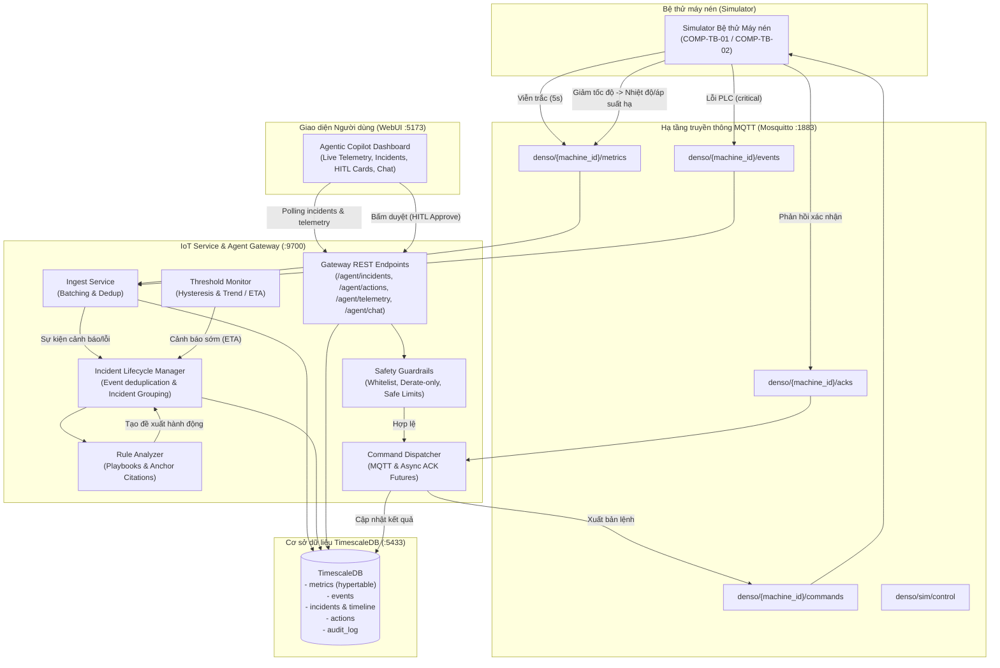

# HỆ THỐNG IOT GIÁM SÁT VÀ PHẢN ỨNG SỰ CỐ BỆ THỬ MÁY NÉN DENSO (GIAI ĐOẠN 2: AGENT GATEWAY, HITL & CLOSED-LOOP CONTROL)

> **Lưu ý quan trọng**: Dự án phục vụ cuộc thi Hackathon. Các chỉ số kỹ thuật vận hành, ngưỡng cảnh báo, mã lỗi và tên định danh thiết bị (`COMP-TB-01`, `COMP-TB-02`) trong dự án này là **GIẢ LẬP**, được xây dựng dựa trên nguyên lý hoạt động của catalogue và poster sự cố điều hòa DENSO, **không phải số liệu đo đạc thực tế bí mật của tập đoàn DENSO**. Toàn bộ các playbook phân tích luật là do nhóm biên soạn từ poster và catalogue tài liệu kỹ thuật, không phải quy trình vận hành chính thức của DENSO.

---

## 1. Tổng quan dự án

Hệ thống IoT cho bệ thử máy nén DENSO là tầng hạ tầng thu thập viễn trắc (telemetry), phát hiện bất thường sớm, quản lý vòng đời sự cố (Incidents), phê duyệt hành động có sự can thiệp của con người (HITL - Human-In-The-Loop) và thực thi kiểm soát vòng kín (Closed-Loop Control) cho bệ thử nghiệm máy nén điều hòa không khí ô tô.

Ở **Giai đoạn 2**, hệ thống dựng tầng **Agent Gateway** (cổng kết nối trực tiếp với giao diện WebUI), hiện thực vòng đời sự cố hoàn chỉnh, bộ phân tích theo luật (Playbook Rule-based Analyzer) trích dẫn tài liệu neo kỹ thuật DENSO, rào chắn an toàn (Safety Guardrails) độc lập, cơ chế chống bấm đúp (Idempotent), giới hạn quyền tự chủ và nhật ký kiểm toán (Audit Log).

### Sơ đồ kiến trúc Giai đoạn 2 (Architecture & Closed-Loop Control)



---

## 2. Hiểu dự án: Khái niệm & Cơ chế Giai đoạn 2

### 2.1. Sự cố (Incident) và Vòng đời
* **Khái niệm**: Khi có sự kiện `WARNING` hoặc `ERROR` mới từ máy nén, hệ thống gom vào sự cố đang mở của máy đó. **Mỗi máy chỉ có tối đa 1 sự cố mở tại một thời điểm**.
* **Các trạng thái**:
  * `active`: Sự cố mới tạo hoặc đang được giám sát (sau khi hành động được đề xuất trong chế độ `advisory`).
  * `awaiting_approval`: Sự cố có hành động can thiệp (ví dụ hạ tốc độ) đang chờ kỹ sư vận hành phê duyệt (HITL Gate).
  * `acknowledged`: Hành động can thiệp đã được phê duyệt và máy nén đã gửi phản hồi `ACK_OK`. Hệ thống bước vào giai đoạn theo dõi giảm nhẹ.
  * `resolved` / `closed`: Tất cả các thông số viễn trắc đã trở về dải bình thường (`normal`) bền vững hoặc được người vận hành đóng thủ công.
* **Dòng thời gian (Timeline)**: Mọi bước từ phát hiện quan sát, tra cứu cẩm nang, kiểm tra chéo cảm biến, đề xuất hành động, kết quả ACK và xác nhận giảm tải đều được ghi lại với nhãn thời gian và trích dẫn chuẩn hóa theo giao diện.

### 2.2. Vì sao cần Con người trong vòng lặp (HITL - Human-in-the-Loop)?
Trong môi trường công nghiệp bệ thử nghiệm ô tô, các can thiệp vào bộ điều khiển PLC tác động trực tiếp đến động cơ, áp suất ga và dòng điện cao thế:
* Máy tính và bộ phân tích có thể đưa ra kết luận chẩn đoán và đề xuất tối ưu.
* Tuy nhiên, thao tác thay đổi tốc độ vòng tua hoặc dừng khẩn cấp bệ thử đòi hỏi kỹ sư vận hành phải đối chiếu trạng thái hiện trường, đồ gá và an toàn lao động trước khi thực hiện.
* **Thẻ duyệt hành động (HITL Action Card)** hiển thị rõ ràng: Lệnh can thiệp, lý do kỹ thuật, thời hạn phản hồi đếm ngược (TTL) và nút Phê duyệt / Từ chối.

### 2.3. Chế độ tự chủ (AUTONOMY_MODE)
Hệ thống hỗ trợ 3 chế độ tự chủ qua biến cấu hình `AUTONOMY_MODE`:
1. `advisory`: Hệ thống chỉ chẩn đoán và hiển thị thông tin cảnh báo, không bao giờ gửi lệnh PLC. Thẻ hành động chỉ mang tính tham khảo.
2. `hitl` *(Mặc định)*: Mọi hành động can thiệp đều phải chờ người vận hành bấm nút phê duyệt trên thẻ hành động trước khi gửi lệnh xuống PLC.
3. `auto_safe`: Các hành động thuộc nhóm an toàn (`SET_RPM` giảm tốc độ trong giới hạn cho phép) được tự động thực thi ngay lập tức để bảo vệ máy nén kịp thời. Lệnh `STOP_TEST` luôn luôn bắt buộc người duyệt. Có giới hạn tự động: tối đa 2 lệnh/sự cố, cách nhau tối thiểu 120 giây.

Khi đặt `AGENT_ENABLED=false`, toàn bộ việc sinh đề xuất và thực thi bị tạm dừng, hệ thống chỉ ghi nhận và cảnh báo.

### 2.4. Rào chắn an toàn (Safety Guardrails)
Rào chắn an toàn được cài đặt thành một lớp kiểm tra độc lập trong code backend (`app/commands.py`), **không tin cậy tuyệt đối vào tham số đề xuất ban đầu** mà kiểm tra lại tại thời điểm chuẩn bị gửi lệnh dựa trên giá trị viễn trắc thời gian thực:
* **Whitelist**: Chỉ cho phép 2 lệnh duy nhất là `SET_RPM` và `STOP_TEST`. Mọi lệnh lạ khác bị từ chối ngay lập tức.
* **Quy tắc chỉ giảm tốc độ**: Lệnh `SET_RPM` chỉ được phép giảm so với tốc độ hiện tại của máy (`target_rpm < current_rpm`). Tuyệt đối cấm tăng tốc độ khi đang có sự cố.
* **Giới hạn tốc độ an toàn**: `target_rpm` không được thấp hơn ngưỡng tốc độ an toàn tối thiểu (`rpm_min_safe` = 800 rpm trong `machines.yaml`) và không vượt quá `rpm_max` (3000 rpm).
* **Lệnh STOP_TEST**: Luôn yêu cầu người phê duyệt (HITL), không bao giờ được tự động thực thi ngay cả trong chế độ `auto_safe`.

### 2.5. Chống bấm đúp (Idempotency) và Thời hạn hành động (Action TTL)
* **Idempotent**: Khi người dùng nhấn Duyệt nhiều lần hoặc mạng chập chờn gửi lặp request `POST /agent/actions/{id}/approve`, hệ thống phát hiện hành động đã ở trạng thái `acked`/`approved` và trả về kết quả ACK trước đó ngay lập tức mà **không gửi lệnh lần hai** xuống broker MQTT.
* **Action TTL**: Hành động đề xuất có thời hạn hiệu lực `ACTION_TTL_S` (mặc định 60s). Nếu quá thời gian này mà không có phản hồi từ người vận hành, hành động chuyển sang `expired`, thẻ bị khóa và không thể thực thi.

### 2.6. Phân biệt "Đã giảm nhẹ" (Mitigated) và "Đã giải quyết" (Resolved)
* **Đã giảm nhẹ (Mitigated)**: Khi hạ tốc độ máy nén, nhiệt độ và áp suất tụt khỏi ngưỡng nguy hiểm `critical` (về mức `warn` hoặc cận an toàn), bảo vệ bệ thử không bị phá hủy hoặc kích hoạt ngắt cưỡng bức PLC. Tuy nhiên, nguyên nhân gốc rễ (ví dụ: mất môi chất lạnh, cháy quạt dàn ngưng, thiếu dầu) **vẫn còn tồn tại**. Phiếu bảo trì/sửa chữa vẫn mở.
* **Đã giải quyết (Resolved)**: Trường hợp như dàn ngưng bẩn (`condenser_fouled`), việc giảm tải đưa toàn bộ các chỉ số về hoàn toàn bình thường (`normal`). Khi các cảm biến ổn định trong vùng chuẩn liên tục, sự cố mới được đánh dấu đã giải quyết xong.

### 2.7. Nhật ký kiểm toán (Audit Log)
Mọi hành động can thiệp, mở sự cố, đề xuất, phê duyệt, từ chối, hết hạn và phản hồi ACK từ máy nén đều được lưu vĩnh viễn vào bảng `audit_log` với đầy đủ thông tin: mốc thời gian `ts`, tác nhân (`system`, `agent`, `user:<tên>`), hành động `action`, ID thiết bị và dữ liệu chi tiết `details`.

---

## 3. Bảng API Gateway (`/agent/*`)

Agent Gateway phục vụ trực tiếp cho giao diện WebUI (chuẩn TypeScript theo `agent.ts` và `types/agentic.ts`):

| Method & Route | Mô tả chức năng | Request Body / Params | Phản hồi chính |
|---|---|---|---|
| `GET /agent/incidents` | Lấy danh sách toàn bộ sự cố kèm snapshot viễn trắc và thẻ hành động | Không | `List[Incident]` |
| `GET /agent/incidents/{id}` | Lấy chi tiết một sự cố cụ thể | `id` (ví dụ `INC-0001`) | `Incident` |
| `GET /agent/telemetry/{deviceId}` | Lấy viễn trắc thời gian thực theo máy (hoặc tra cứu theo `INC-xxxx`) | `deviceId` (`COMP-TB-01`) | `TelemetrySnapshot` (kèm `direction`, `isAnomalous`) |
| `POST /agent/actions/{id}/approve` | Kỹ sư phê duyệt hành động (HITL) | `id` (ví dụ `ACT-0001`) | `{"ack": "ACK 200: ..."}` |
| `POST /agent/actions/{id}/reject` | Kỹ sư từ chối hành động | `id` (ví dụ `ACT-0001`) | `{"status": "ok"}` |
| `POST /agent/chat` | Hỏi đáp hội thoại có cấu trúc với dữ liệu sự cố (Chế độ luật) | `{"conversationId": "CONV-0001", "message": "..."}` | `{"content": "...", "citations": [...]}` |

---

## 4. Hướng dẫn chạy nhanh hệ thống (PowerShell)

Mở các cửa sổ PowerShell tại thư mục gốc repository:

### Bước 1: Khởi động Hạ tầng Docker (TimescaleDB & Mosquitto)
```powershell
docker compose -f iot_service/docker-compose.iot.yml up -d
docker compose -f iot_service/docker-compose.iot.yml ps
```

### Bước 2: Khởi động Backend IoT Service & Agent Gateway (Port 9700)
```powershell
cd iot_service
.\.venv\Scripts\Activate.ps1
$env:PYTHONPATH="."
python -m uvicorn app.main:app --host 0.0.0.0 --port 9700
```

### Bước 3: Khởi động Simulator Bệ thử Máy nén
```powershell
cd iot_service
.\.venv\Scripts\Activate.ps1
$env:PYTHONPATH="."
python -m simulator.cli run
```

### Bước 4: Khởi động WebUI ở chế độ kết nối dữ liệu thật (`VITE_DEMO_MODE=false`)
```powershell
cd lightrag_webui
$env:VITE_DEMO_MODE="false"
bun run dev
# Truy cập giao diện tại: http://localhost:5173
```
*(Nếu muốn chạy lại chế độ demo dữ liệu giả lập cũ của WebUI, chỉ cần đặt `$env:VITE_DEMO_MODE="true"` rồi chạy `bun run dev`)*.

---

## 5. Kịch bản Demo từng bước (Step-by-Step Demo Walkthrough)

Hệ thống cung cấp sẵn công cụ demo tự động bằng Python: `python -m iot_service.scripts.demo <kịch_bản>`.

### Kịch bản A: Quạt dàn ngưng hỏng (`condenser_fan_failure`) - Vòng lặp HITL
1. **Kích hoạt sự cố**:
   ```powershell
   python -m simulator.cli set COMP-TB-01 condenser_fan_failure --ramp 10
   ```
2. **Quan sát trên WebUI**:
   * Sau ~10-15s, quạt giảm về 0 rpm, áp suất xả tăng vọt trên 23 bar, nhiệt độ đầu xả vượt 120°C.
   * Thanh viễn trắc (Telemetry Bar) của `COMP-TB-01` hiển thị viền đỏ cảnh báo.
   * Danh sách sự cố bên trái xuất hiện sự cố mới `INC-0001` với trạng thái `AWAITING_APPROVAL` (Chờ duyệt).
   * Bộ phân tích theo luật kết luận nguyên nhân gốc rễ: *"Quạt giải nhiệt dàn ngưng hỏng hoặc kẹt"*, độ tin cậy 92%, trích dẫn tài liệu *AC-Condenser-Installation-Manual-Multilingual_web.pdf (trang 1-3)*.
   * Thẻ duyệt hành động (HITL Action Card) xuất hiện đếm ngược 60s, đề xuất: `SET_RPM` máy nén xuống 1000 RPM.
3. **Phê duyệt hành động**:
   * Kỹ sư nhấn nút **"Xác nhận thực hiện"** trên thẻ.
   * Gateway kiểm tra Guardrails -> gửi lệnh qua MQTT -> nhận `ACK 200` từ simulator trong vòng < 1 giây.
   * Thẻ chuyển trạng thái xanh *"Đã thực thi thành công"*.
4. **Quan sát vòng điều khiển kín**:
   * Tốc độ máy nén giảm về 1000 rpm -> nhiệt độ xả hạ từ 128°C xuống ~108°C (rời khỏi ngưỡng nguy hiểm).
   * Sự cố chuyển sang trạng thái "Đã giảm nhẹ" (`acknowledged`), phiếu sửa chữa quạt vẫn mở.
   * Nếu người dùng bấm duyệt lần 2, hệ thống phản hồi ngay mã ACK trước đó mà không gửi thêm lệnh (Idempotent).

### Kịch bản B: Dàn ngưng bám bụi bẩn (`condenser_fouled`) - Tự hồi phục về Bình thường
1. **Kích hoạt sự cố**:
   ```powershell
   python -m simulator.cli set COMP-TB-01 condenser_fouled --ramp 10
   ```
2. **Diễn biến**:
   * Áp suất xả tăng đến 21.5 bar (ngưỡng Cảnh báo `warn`), nhiệt độ xả 112°C, quạt vẫn quay 2300 rpm bình thường.
   * Gateway mở sự cố, đề xuất hạ tốc độ máy nén về 1000 RPM để vệ sinh dàn nóng.
   * Bấm Duyệt -> tốc độ máy giảm xuống 1000 RPM -> áp suất xả và nhiệt độ giảm sâu về hoàn toàn trong dải an toàn (`normal`).
   * Vòng lặp giám sát phát hiện toàn bộ chỉ số đã hồi phục -> sự cố tự động đóng (`resolved`).

### Kịch bản C: Thiếu dầu bôi trơn (`low_oil`) & Chế độ `auto_safe`
1. Đặt biến môi trường `$env:AUTONOMY_MODE="auto_safe"` và khởi động Gateway.
2. Kích hoạt sự cố:
   ```powershell
   python -m simulator.cli set COMP-TB-01 low_oil --ramp 10
   ```
3. **Kết quả Guardrail**:
   * Mức dầu tụt xuống 35%, độ rung vọt lên 7.5 mm/s.
   * Playbook nhận diện nguy cơ bó máy và đề xuất `STOP_TEST` (Dừng máy khẩn cấp).
   * **Mặc dù đang ở chế độ auto_safe**, rào chắn an toàn kiên quyết giữ lệnh `STOP_TEST` ở trạng thái chờ người duyệt (`awaiting_approval`), không tự động dừng máy nếu không có sự xác nhận của kỹ sư.

---

## 6. Chạy bộ kiểm thử tự động (Pytest)

Toàn bộ các yêu cầu của Giai đoạn 1 và Giai đoạn 2 đã được kiểm thử với 39 bài test:

```powershell
$env:PYTHONPATH="iot_service"
.\iot_service\.venv\Scripts\pytest.exe iot_service\tests -v
```

**Kết quả: 39/39 bài test XANH (100% Pass)**:
* `test_guardrails_and_actions.py`: Kiểm tra Whitelist lệnh, cấm tăng tốc độ, cấm dưới `rpm_min_safe`, bắt buộc HITL với `STOP_TEST`, kiểm tra quá hạn Action TTL, chống bấm đúp (Idempotent), giới hạn 2 lệnh tự động trong `auto_safe`, cờ `AGENT_ENABLED=false`.
* `test_incidents_lifecycle.py`: Gom sự cố theo máy (1 sự cố mở/máy), kiểm thử toàn bộ endpoint Gateway REST (`/agent/incidents`, `/agent/telemetry`, `/agent/chat`), kiểm thử vòng điều khiển kín End-to-End (sự cố -> duyệt -> ACK -> giảm tải).
* `test_playbooks.py`: Khớp chính xác 4 kịch bản lỗi với 4 playbook, độ tin cậy $\ge 0.9$, trích dẫn neo tài liệu, cơ chế fallback sự cố chưa xác định, ánh xạ độ nghiêm trọng.
* 23 bài test gốc của Giai đoạn 1 (Simulator, Monitor, Dedup, Tool API, Thresholds).

---

## 7. Thay đổi ngoài `iot_service/` (Cập nhật WebUI)

Mọi thay đổi trên frontend được giới hạn nghiêm ngặt trong `lightrag_webui/` và hoàn toàn có điều kiện, đảm bảo chế độ mock demo (`VITE_DEMO_MODE=true`) vẫn hoạt động nguyên vẹn:

1. `lightrag_webui/vite.config.ts`:
   * Bổ sung reverse proxy cho đường dẫn `/agent` trỏ tới `http://localhost:9700` (Agent Gateway), giữ nguyên proxy của LightRAG tới port 9621.
2. `lightrag_webui/src/features/agentic/types/agentic.ts`:
   * Bổ sung trường tùy chọn `direction?: 'above' | 'below' | 'info'` trong `TelemetryPoint` để hỗ trợ hiển thị bất thường cho các thông số "thấp là xấu" (áp suất hút, quạt, dầu).
   * Bổ sung trường tùy chọn `timeline?: any[]` trong `Incident`.
3. `lightrag_webui/src/features/agentic/hooks/useLiveTelemetry.ts`:
   * Loại bỏ phụ thuộc làm tái tạo timer liên tục; khi `VITE_DEMO_MODE=false`, hook tự động polling `/agent/telemetry/{deviceId}` mỗi 3s.
   * Sửa lỗi đánh giá ngưỡng tĩnh cứng bằng cách đọc trực tiếp cờ `isAnomalous` và `direction` do máy chủ tính toán.
4. `lightrag_webui/src/features/agentic/stores/agenticStore.ts`:
   * Hỗ trợ polling danh sách sự cố thật từ `/agent/incidents` mỗi 4 giây khi ở chế độ thật.
   * Chuyển đổi hàm `approveAction` và `rejectAction` sang gọi trực tiếp API backend thay vì mô phỏng giả lập `setTimeout`.
5. `lightrag_webui/src/features/agentic/components/ChatWorkspace.tsx`:
   * Chuyển tiếp tin nhắn chat tới Gateway endpoint `/agent/chat` khi `VITE_DEMO_MODE=false`.
6. `lightrag_webui/.env.development` & `lightrag_webui/.env.example`:
   * Khai báo biến `VITE_DEMO_MODE=false` và `VITE_GATEWAY_URL=http://localhost:9700`.

---

## 8. Giả định, Giới hạn & Đề xuất Giai đoạn 3

### Giả định và Giới hạn hiện tại
* **Playbook theo luật**: Quy tắc phân tích sự cố được trích xuất từ tài liệu hướng dẫn kỹ thuật và poster sự cố máy nén DENSO. Đây là phiên bản giả lập phục vụ bài thi, không phải quy trình bảo trì chính thức của hãng.
* **Chưa tích hợp LLM & RAG động**: Ở Giai đoạn 2, bước tra cứu tài liệu và hội thoại chat sử dụng dữ liệu tĩnh chuẩn hóa từ playbook. Phản hồi chat mang tính cấu trúc và có chú thích rõ ràng `[Chế độ phân tích theo luật / Rule-based mode]`.

### Đề xuất cho Giai đoạn 3
1. **Thay thế BaseAnalyzer bằng Agent LLM**: Triển khai ReAct loop với mô hình ngôn ngữ lớn (kết nối qua `LLM_BASE_URL`), gọi Tool API nội bộ để tự động suy luận nguyên nhân và quyết định hành động.
2. **Tích hợp RAG thực tế**: Kết nối máy chủ LightRAG (port 9621) để tìm kiếm động các đoạn trích kỹ thuật trong thư viện PDF của DENSO thay cho các đoạn trích neo tĩnh.
3. **Tự động sinh phiếu bảo trì (Work Order)**: Kết xuất phiếu sửa chữa hoàn chỉnh với đầy đủ mã phụ tùng, linh kiện thay thế và quy trình thao tác chuẩn gửi tới kỹ thuật viên.
